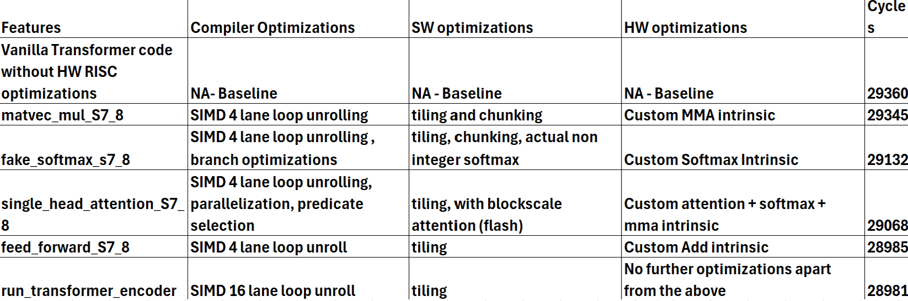
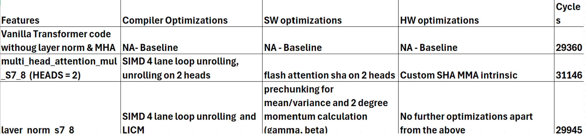

## RISCV: 

## Presentation Slides:

[Accelerating Accelerating LLM inference with SIMD MHA Blockscale attention for RISC-V 
](https://docs.google.com/presentation/d/13AZNoOZT7NhfZlPqjlHD0enUwyGVySpQ/edit#slide=id.g34eac589fa7_0_7)

## Benchmark Results 

The results are segregated into 2 components:

- Modifying existing main.c(SW_IA) with Single Head Attention and Tiling along with coded Loop optimizations

- Modifying existing hackaton.codal (HWISA) by extending the 5 CPU RISCV instructions with custom softmax , matrix dot product, attention scaling, and default residual addition connections

# Results 1.0

- Extend with feature implementation - MHA, Layernorm, Blockscale Attention (Flash) and Tiling along with coded Loop optimizations

# Results 2.0

