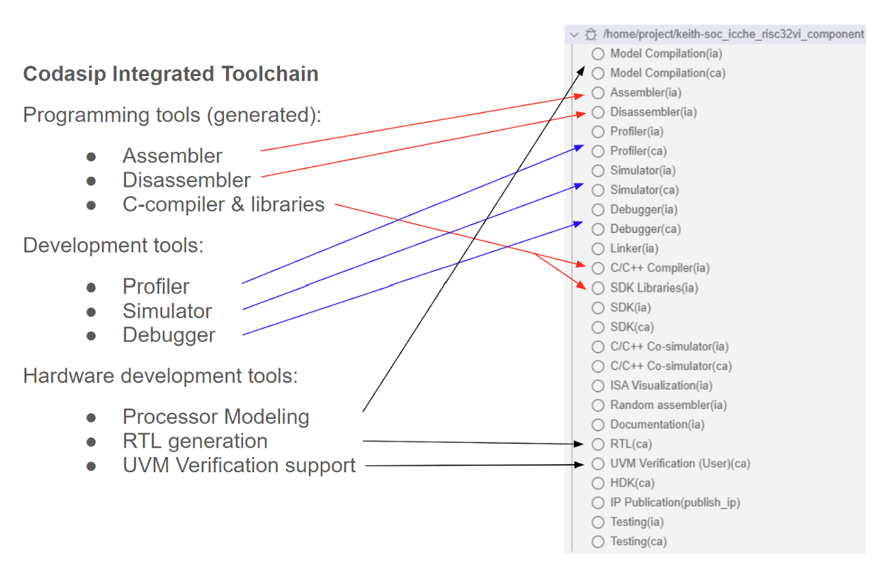
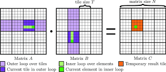
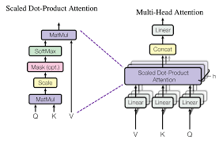
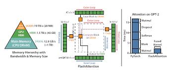

## RISCV:  Accelerating LLM Inference with SIMD Flash MHA, Tiling and Compiler optimizations on RISCV

Codasip is a HW/SW codesign platform following C and inline RISC-V assembly for simulating complex algorithms such as transformers
We use this platform to ensure IA(Instruction Accurate) and CA(Cycle Accurate) representation of our code base.
Existing codebase is split into codasip_urisc_v (HW) and hackathon_sw(SW) sections for IA (Instruction Accurate) and (CA)Cycle Accurate code.

The existing codebase modification was split into these 2 sections:
- src/main.c (SW): Extend with feature implementation - MHA, Layernorm, Blockscale Attention (Flash) and Tiling along with coded Loop optimizations

- isa_hackaton.codal: Extend the 5 CPU RISCV instructions with custom softmax , matrix dot product, attention scaling, and default residual addition connections

A memory model of codasip RISCV platform is presented here:

## Optimizations Used:

- Tiling and SIMD 4-16 lane loop unrolling:

  

- MHA

 

- Flash Attention

 

- HW custom ISA

## Presentation Slides:

[Accelerating Accelerating LLM inference with SIMD MHA Blockscale attention for RISC-V 
](https://docs.google.com/presentation/d/13AZNoOZT7NhfZlPqjlHD0enUwyGVySpQ/edit#slide=id.g34eac589fa7_0_7)

## Benchmark Results 

The results are segregated into 2 components:

- Modifying existing main.c(SW_IA) with Single Head Attention and Tiling along with coded Loop optimizations

- Modifying existing hackaton.codal (HWISA) by extending the 5 CPU RISCV instructions with custom softmax , matrix dot product, attention scaling, and default residual addition connections

# Results 1.0

- Extend with feature implementation - MHA, Layernorm, Blockscale Attention (Flash) and Tiling along with coded Loop optimizations

# Results 2.0

